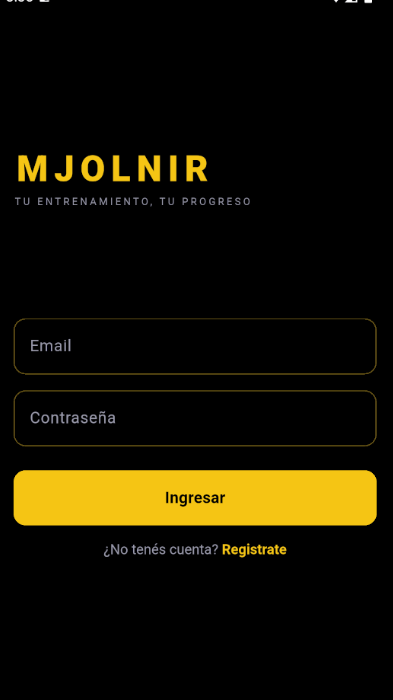
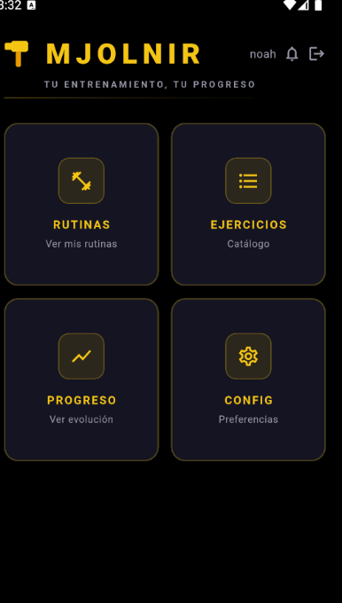
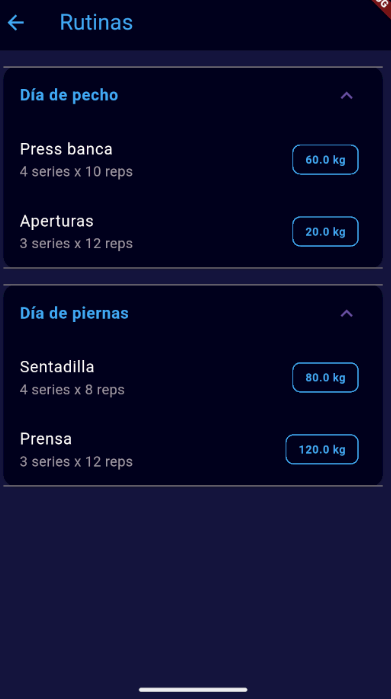
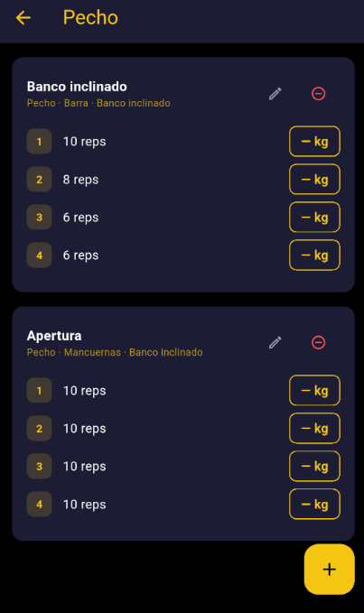

# Mjolnir 💪

Aplicación móvil para gestión de rutinas de gimnasio, desarrollada con Flutter.

## ¿Qué hace?

Permite a trainers y alumnos gestionar ejercicios, rutinas y registrar el progreso de peso a lo largo del tiempo. Los trainers pueden vincularse con sus alumnos y asignarles rutinas personalizadas.

## Funcionalidades

- Autenticación con email y contraseña (Firebase Auth)
- Perfiles de trainer y alumno con roles diferenciados
- Vinculación trainer-alumno mediante solicitudes
- Catálogo de ejercicios por músculo, equipamiento y variante
- Rutinas con series de repeticiones personalizadas por ejercicio
- Registro de peso individual por serie
- Historial de progreso con gráfico de evolución por ejercicio
- Configuración de unidad de peso (kg / lb)
- Persistencia de datos en la nube (Firestore)

## En desarrollo

- Asignación de rutinas del trainer al alumno
- Foto de perfil de usuario
- Registro de progreso histórico ampliado

## Tecnologías

- [Flutter](https://flutter.dev/) / Dart
- Firebase Auth — autenticación
- Cloud Firestore — base de datos en la nube
- shared_preferences — persistencia local
- fl_chart — gráficos de progreso
- Arquitectura por capas: models, screens, components, services, core

## Capturas






## Cómo correrlo

1. Cloná el repositorio
2. Configurá Firebase con tu propio proyecto y generá `firebase_options.dart`:
```
   flutterfire configure
```
3. Instalá las dependencias:
```
   flutter pub get
```
4. Corré la app:
```
   flutter run
```

## Autor

Román Davolio — [LinkedIn](https://www.linkedin.com/in/roman-davolio/)