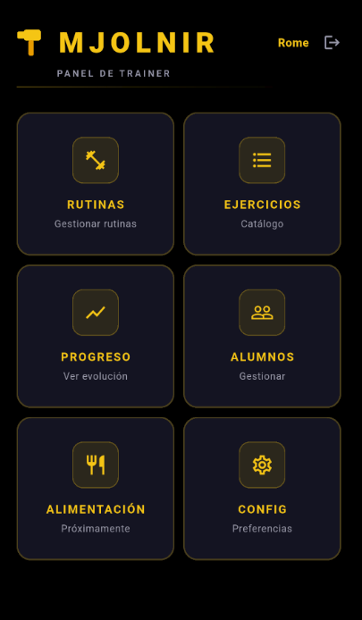
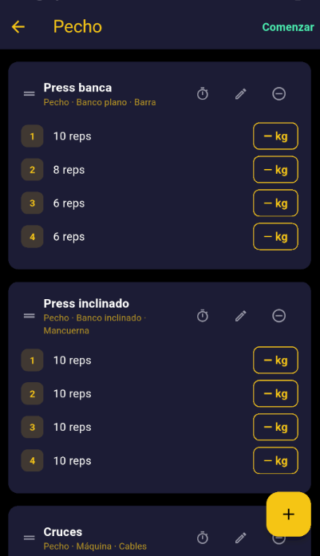
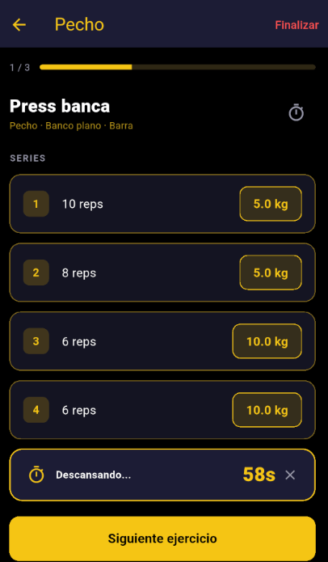
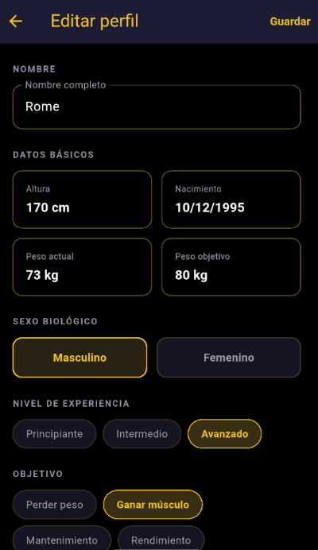
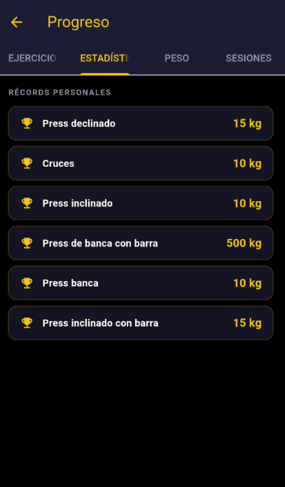
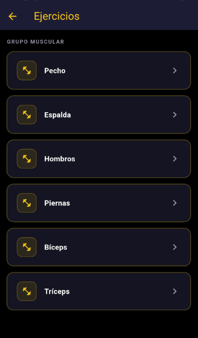
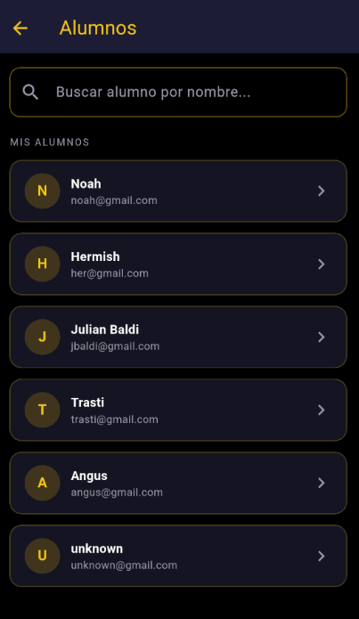
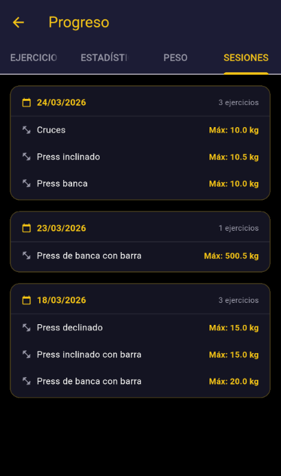

# Mjolnir 💪

Aplicación móvil para gestión de rutinas de gimnasio, desarrollada con Flutter y Firebase.

## ¿Qué hace?

Permite a trainers y alumnos gestionar ejercicios, rutinas y registrar el progreso de peso a lo largo del tiempo. Los trainers pueden vincularse con sus alumnos, asignarles rutinas personalizadas y visualizar su evolución.

## Imágenes










## Funcionalidades

### Autenticación y perfiles
- Registro e inicio de sesión con email y contraseña
- Perfiles diferenciados: trainer y alumno
- Datos personales: fecha de nacimiento, altura, peso, objetivo, nivel de experiencia y lesiones
- Pantalla de perfil con acceso al historial de peso corporal
- Edición de perfil personal
- Onboarding para nuevos usuarios

### Vinculación trainer-alumno
- Solicitudes de vinculación con notificaciones push
- Múltiples trainers por alumno — cada trainer es independiente
- Desvinculación desde ambos lados con notificación a la contraparte
- El alumno puede compartir rutinas propias con sus trainers
- Aviso automático si el alumno tiene rutinas de trainers desvinculados

### Trainer
- Gestión de alumnos vinculados con refresh automático
- Visualización de datos personales del alumno
- Último entrenamiento del alumno visible
- Asignación de rutinas personalizadas a alumnos
- Visualización de rutinas compartidas por el alumno
- Visualización de pesos, progreso e historial de sesiones del alumno
- Visualización del historial de peso corporal del alumno
- Edición de rutinas asignadas
- Eliminación de rutinas sin pesos cargados

### Alumno
- Gestión de trainers vinculados con opción de desvincular
- Recepción y gestión de solicitudes de vinculación
- Visualización de rutinas asignadas con nombre del trainer
- Compartir rutinas propias con trainers vinculados
- Creación, edición y duplicación de rutinas propias
- Sesión de entrenamiento guiada con navegación ejercicio por ejercicio
- Notas privadas por rutina y por ejercicio con emojis predefinidos

### Sesión de entrenamiento
- Pantalla dedicada al entrenamiento con progreso visual
- Navegación de a un ejercicio por vez
- Carga de pesos por serie con selector deslizable (enteros + decimales .25/.50/.75, hasta 500kg)
- Último peso registrado visible por serie
- Timer de descanso automático al guardar un peso
- Timer de descanso manual configurable por ejercicio
- Tiempo de descanso persistido por ejercicio — recuerda el último usado
- Botón "Siguiente ejercicio" y "Finalizar rutina" al llegar al último
- Pantalla de resumen al finalizar con duración, volumen total, récords batidos y pesos por serie

### Ejercicios y rutinas
- Catálogo global de ejercicios con navegación jerárquica: músculo → elemento → acompañamiento → ejercicio
- Solo lectura — el catálogo es administrado por el desarrollador
- Reordenamiento de ejercicios por arrastre dentro de una rutina
- Rutinas con series configurables mediante selector deslizable (1-50 reps)
- Series con valor por defecto igual a la serie anterior
- Duplicar rutinas con nombre personalizado
- Editar nombre de rutinas existentes

### Progreso y estadísticas
- Historial de progreso con gráfico de evolución por ejercicio
- Récords personales por ejercicio visibles en la lista
- Progreso mensual comparativo
- Historial de sesiones de entrenamiento agrupadas por día
- Historial de peso corporal con gráfico de evolución y comparativa desde el inicio
- Último día de entrenamiento visible en la pantalla principal

### Configuración
- Unidad de peso configurable (kg / lb) sincronizada en la nube
- Edición de perfil personal

## Arquitectura
```
lib/
  core/           # Colores y catálogo global de ejercicios (ExerciseCatalog)
  models/         # UserProfile, Routine, Exercise, Serie, AssignedRoutine, BodyWeightEntry, WeightEntry, LinkRequest
  screens/        # Todas las pantallas de la app
  services/       # AuthService, RoutineService, LinkService, UserService, NotificationService, BodyWeightService, StatsService
  components/     # Widgets reutilizables
```

## Decisiones de arquitectura
- Lógica en screens (no controllers) — válido para escala actual
- Catálogo de ejercicios hardcodeado en el cliente — sin posibilidad de edición por usuarios
- Firestore como fuente de verdad — shared_preferences solo para preferencias locales
- Modo offline habilitado con persistencia automática de Firestore
- Reglas de seguridad de Firestore configuradas por colección

## Tecnologías

- [Flutter](https://flutter.dev/) / Dart
- Firebase Auth — autenticación
- Cloud Firestore — base de datos en la nube con reglas de seguridad y modo offline
- Firebase Cloud Messaging — notificaciones push
- shared_preferences — preferencias locales
- fl_chart — gráficos de progreso

## En desarrollo

- Foto de perfil — requiere plan de pago en Firebase Storage
- Sección de alimentación
- Búsqueda global en el catálogo de ejercicios

## Cómo correrlo

1. Cloná el repositorio
2. Configurá Firebase con tu propio proyecto y generá `firebase_options.dart`:
```
   flutterfire configure
```
3. Instalá las dependencias:
```
   flutter pub get
```
4. Corré la app:
```
   flutter run
```

## Autor

Román Davolio — [LinkedIn](https://www.linkedin.com/in/roman-davolio/) — [GitHub](https://github.com/romandavolio/mjolnir)